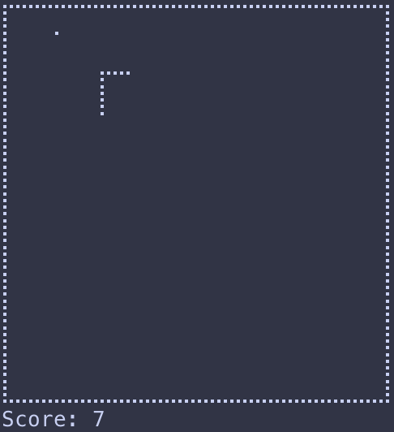

# Terminal Snake Game

A simple Snake game written in **Go**, playable directly in your terminal.

**Note:** Not currently supported on Windows

## Installation

Download the latest release for your operating system from the **[Releases](https://github.com/theaaronruss/snake/releases)** page.

Alternatively, you can build it from source:

```bash
git clone https://github.com/theaaronruss/snake.git
cd snake
go build .
```

## Controls

Use &uarr; &darr; &larr; &rarr; to move

Use q to quit

You can alternatively use Vim-style movement with j, k, h, and l.

## Screenshots



